# coffeeMachine
### Description
A single page web application build with React.js, & styled with Sass.

### Functionality
It has included 6 sections, as required: **Landing**, **Description**, **Top Features**, **Technical Details**, **What's Included** and **Buy Now**. 

For a smooth user experience a **Tracking Navbar** was included which actively highlights the section a user is on at a certain moment.

For styling it was used **Sass** which keeps everything organised using CSS Variables & Includes. This way the Styling File Tree is exactly the same as the React-App one which makes everything easy-to-find.
This web app was build for any type of screen on any device (TV, Desktop, Tablet, Smartphone) using modern responsive techniques such as **Responsive Typography** or **Responsive Images**. All elements were included in a custom made **12-colum Grid System**.

The **Footer** includes a copyright module which has a date function. That date is generated using Javascript in real time. If the year changes, the date changes automatically.

## Snapshots
| Desktop | Mobile|
| --------------------------- |:--------------------------:|
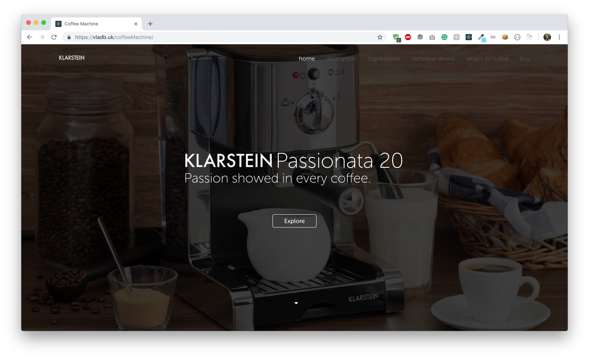 | 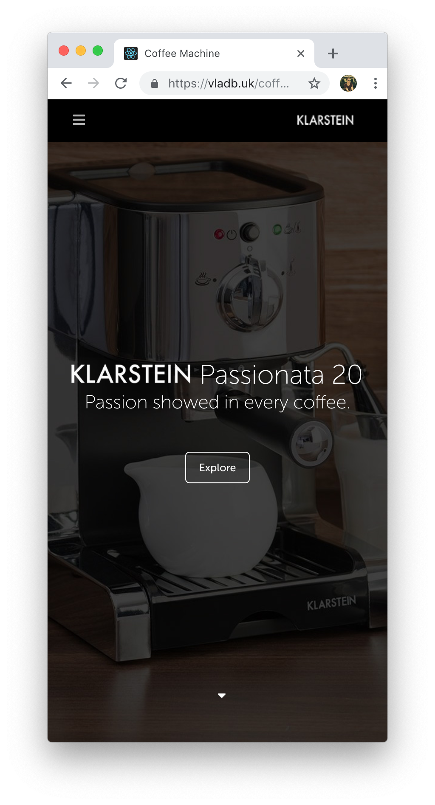
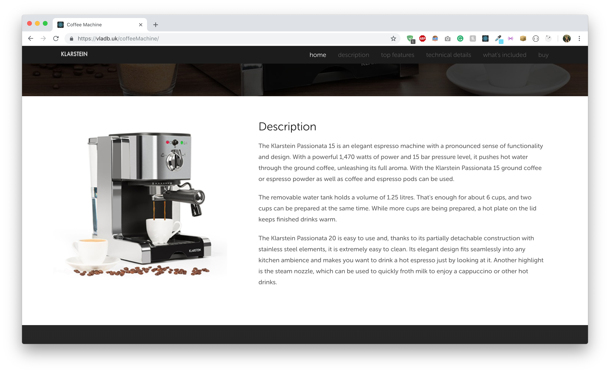 | 
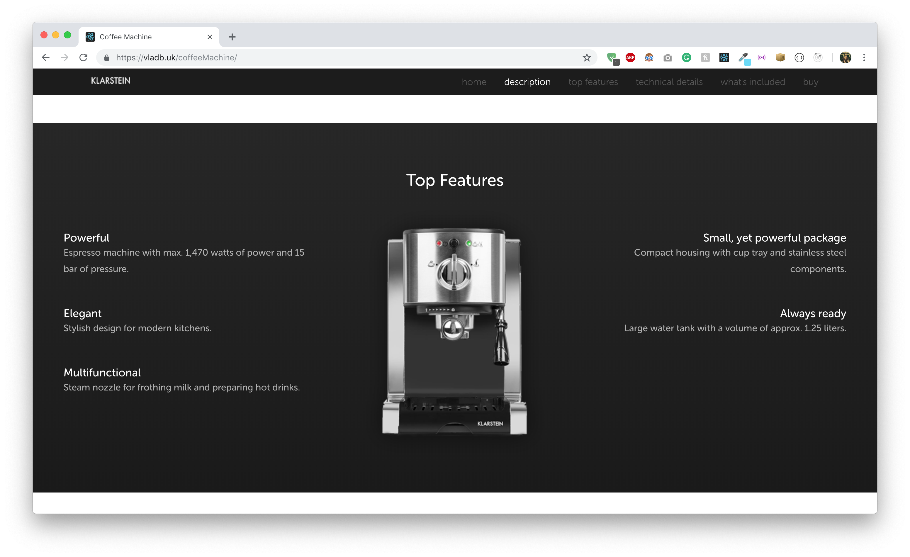 | 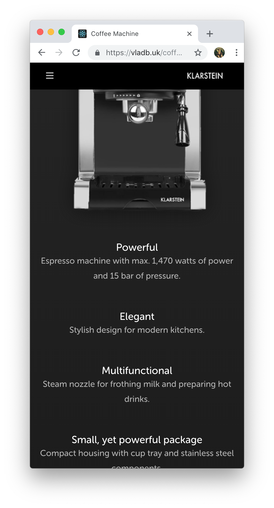
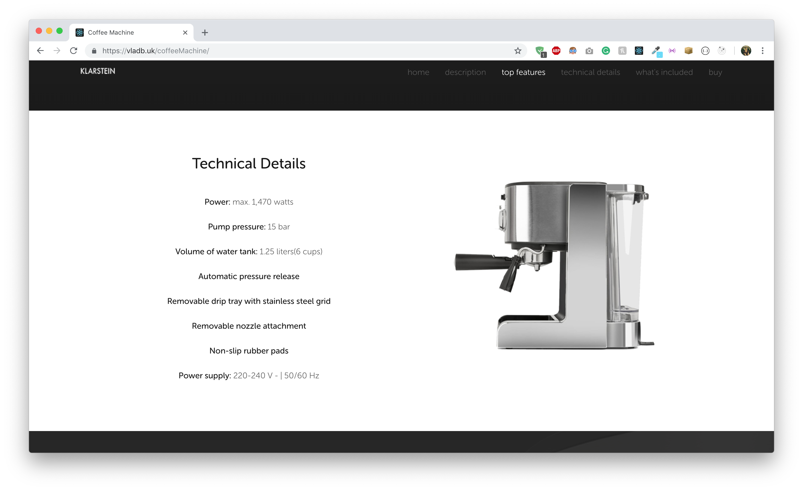 | 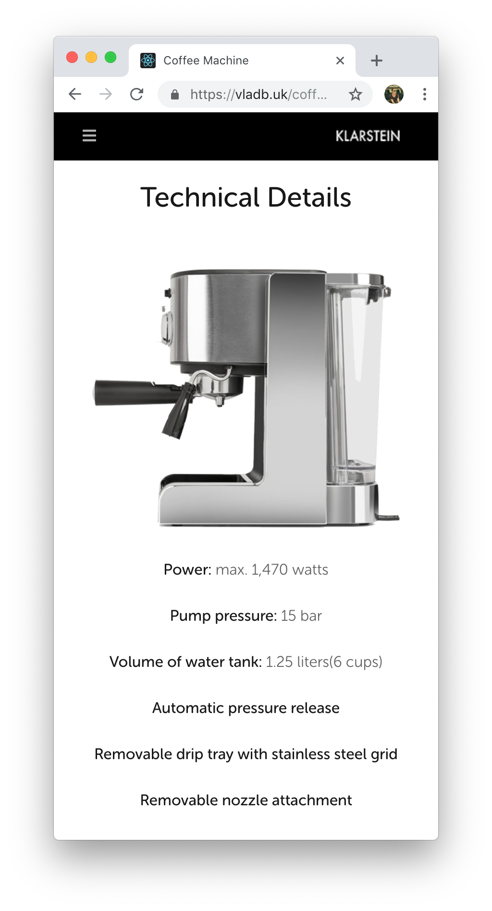
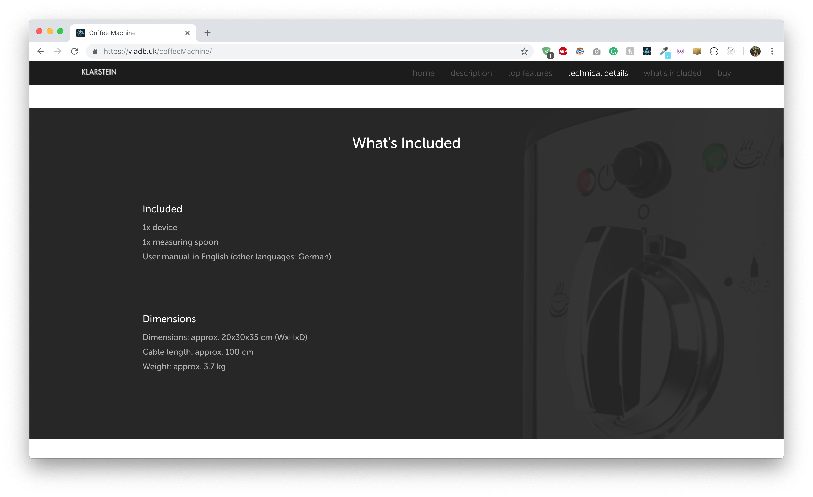 | 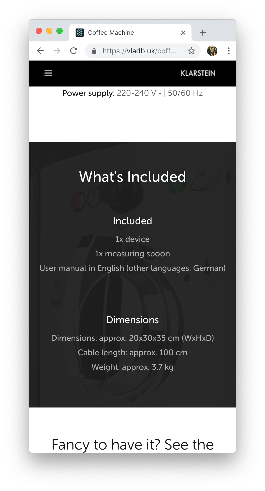
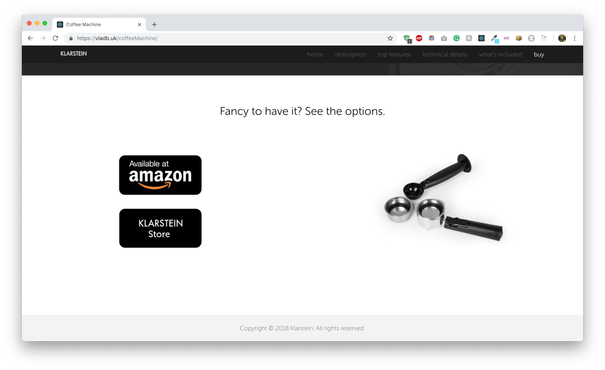 | 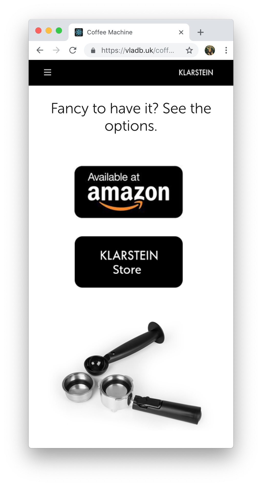

### Live Preview:
[https://vladb.uk/coffeeMachine](https://vladb.uk/coffeeMachine)

## Completed Test Plan
| Task                                                 | Completed          |
| ---------------------------------------------------- | ------------------ |
| Use **React.js** as a front-end framework            | :white_check_mark: |
| Use **Sass** for styling (with Vars & Includes)      | :white_check_mark: |
| Use **Styled Components** with JS/Sass               | :white_check_mark: |
| Have >= **6 sections**                               | :white_check_mark: |
| Layout based on a custom made **grid**               | :white_check_mark: |
| **Responsive Grid**                                  | :white_check_mark: |
| Work with >= **2 devices screens**                   | :white_check_mark: |
| Easy to use **Navigation**                           | :white_check_mark: |
| **Responsive Navigation** for mobile                 | :white_check_mark: |
| **Trackable Links**                                  | :white_check_mark: |
| **Responsive Typography**                            | :white_check_mark: |
| **Responsive Images**                                | :white_check_mark: |
| **Hover Effects** on Links                           | :white_check_mark: |
| **Animated Content** on Reveal                       | :white_check_mark: |
| **Real Time Date**                                   | :white_check_mark: |
| Integrate **Github Pages** for deployment            | :white_check_mark: |
| Deploy a **production build** for better performance | :white_check_mark: |   

### System Preparation
If you want to use this app, you need to have installed **Node.js** on your machine.

### Development mode
1. `git clone` this repository into your environment.
2. `cd` into the app folder.
3. `npm install` to install all necesesarry dependencies.
4. `npm start` to run the app
5. Open the app in your favourite code editor.
6. Happy hacking!